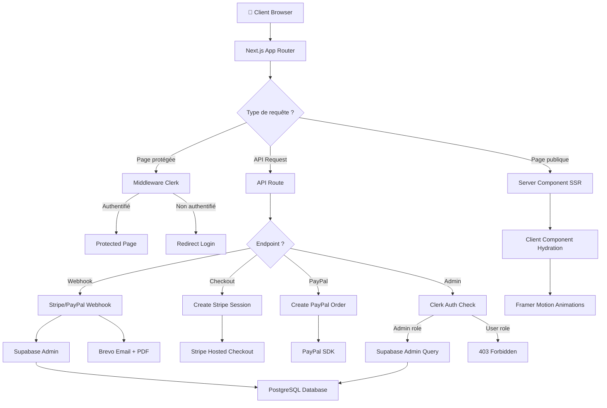

# 💚 Kenomi - Plateforme SaaS de Formation & Crowdfunding

> Application web full-stack Next.js 15 pour Kenomi ASBL : formations en cybersécurité, dons en ligne, et gestion administrative complète avec dashboard analytics.

[](https://nextjs.org/)
[](https://www.typescriptlang.org/)
[](https://react.dev/)
[](https://supabase.com/)
[](https://stripe.com/)
[](https://clerk.com/)
[](https://tailwindcss.com/)
[](https://vercel.com/)
[](https://opensource.org/licenses/MIT)

🌐 **Site en production :** [kenomi.eu](https://kenomi.eu)

---

## 📋 Table des matières

- [🎯 À propos](#-à-propos)
- [✨ Fonctionnalités principales](#-fonctionnalités-principales)
- [🛠️ Stack technique](#️-stack-technique)
- [📦 Prérequis](#-prérequis)
- [🚀 Installation rapide](#-installation-rapide)
- [⚙️ Configuration détaillée](#️-configuration-détaillée)
- [🧪 Tests](#-tests)
- [🌐 Déploiement](#-déploiement)
- [🏗️ Architecture](#️-architecture)
- [📜 Scripts disponibles](#-scripts-disponibles)
- [🔌 API Routes](#-api-routes)
- [🔐 Sécurité](#-sécurité)
- [🤝 Contribution](#-contribution)
- [📄 Licence](#-licence)

---

## 🎯 À propos

**Kenomi** est une plateforme complète développée pour **Kenomi ASBL**, une association belge engagée dans la **réduction de la fracture numérique**. L'application combine :

### 🎓 Volet Formation
- **Formations professionnelles** en cybersécurité pour PME et ASBL
- **Ateliers citoyens** pour seniors et grand public
- **Programmes jeunesse** (8-12 ans) - "Deviens un Agent Secret d'Internet"
- **Système de réservation** et gestion des inscriptions

### 💚 Volet Social
- **Plateforme de dons** sécurisée (Stripe + PayPal)
- **Dons uniques** et **abonnements mensuels**
- **Reçus fiscaux** générés automatiquement (PDF)
- **Programme "Tremplin Numérique"** : kits d'autonomie pour jeunes en précarité

### 📊 Dashboard Administrateur
- **Analytics en temps réel** avec Chart.js
- **Gestion complète des dons** (tableaux, filtres, exports)
- **Statistiques détaillées** (top donateurs, graphiques mensuels)
- **Export CSV/PDF** des données
- **Système de rôles** (admin/user) avec Clerk

### 🌍 Impact
100% des bénéfices réinvestis dans l'autonomie numérique en Belgique

---

## ✨ Fonctionnalités principales

### 🎨 Interface Utilisateur

| Fonctionnalité | Description | Technologie |
|----------------|-------------|-------------|
| **Page d'accueil dynamique** | Hero animé, sections scroll-spy, témoignages | Framer Motion, Next.js 15 |
| **Formulaire de don multi-étapes** | Sélection montant, fréquence, paiement | React 19, TypeScript |
| **Design responsive** | Mobile-first, adaptatif tablette/desktop | Tailwind CSS 4 |
| **Animations fluides** | Transitions page, micro-interactions | Framer Motion |
| **Mode sombre** | Thème adaptable (à venir) | CSS Variables |

### 💳 Système de Paiement

- ✅ **Intégration Stripe** : paiements carte, abonnements mensuels
- ✅ **Intégration PayPal** : alternative de paiement (dons uniques uniquement)
- ✅ **Webhooks sécurisés** : validation signatures, synchronisation BDD
- ✅ **Gestion des montants** : prédéfinis (25€, 50€, 150€) ou personnalisés
- ✅ **Fréquences multiples** : don unique ou mensuel (abonnement)
- ✅ **Page de confirmation** : message de remerciement, redirection

### 📧 Notifications & Reçus

- ✅ **Emails transactionnels** via Brevo (ex-Sendinblue)
- ✅ **Génération automatique de PDF** (reçus fiscaux) avec pdf-lib
- ✅ **Envoi avec pièce jointe** : reçu fiscal joint à l'email de confirmation
- ✅ **Templates personnalisés** : emails HTML responsive
- ✅ **Newsletter** : système d'inscription avec consentement RGPD

### 📊 Dashboard Administrateur

#### Analytics & Statistiques
- 📈 **Graphiques mensuels** : montants collectés + nombre de dons (Chart.js)
- 🏆 **Top 5 donateurs** : agrégation par email, total des contributions
- 💰 **KPIs en temps réel** : total collecté, moyenne, nombre de dons, donateurs uniques
- 📊 **Graphique donut** : répartition des statuts (réussi/en attente/échoué)

#### Gestion des Dons
- 🔍 **Recherche avancée** : par nom, email, montant, statut, devise
- 📅 **Filtres par date** : plage personnalisée, mois prédéfinis
- 💵 **Filtre montant minimum** : seuil personnalisable
- 🔀 **Tri multi-colonnes** : par date, montant, nom (asc/desc)
- 📄 **Pagination** : 20 résultats par page, navigation intuitive
- 📥 **Export données** : CSV et PDF avec jsPDF + autoTable
- 👁️ **Modal détails** : vue complète d'un don (animation Framer Motion)

#### Interface Admin
- 🎨 **Design moderne** : sidebar sombre, cards glassmorphism
- 🌓 **Toggle dark/light mode** : persistance locale
- 🔔 **Notifications** : badge alertes (à venir)
- 📱 **Responsive complet** : menu mobile, layout adaptatif
- ⚡ **Performance optimisée** : requêtes paginées, lazy loading

### 🔐 Authentification & Autorisation

- ✅ **Clerk Auth** : SSO, OAuth, gestion utilisateurs
- ✅ **Role-Based Access Control** : rôles admin/user dans les métadonnées
- ✅ **Protection des routes** : middleware Next.js + Clerk
- ✅ **Session management** : tokens JWT, refresh automatique
- ✅ **Pages protégées** : `/admin/*`, `/dashboard`

### 🗄️ Base de Données

- ✅ **Supabase PostgreSQL** : BDD relationnelle avec Row-Level Security
- ✅ **Tables structurées** : donations, subscribers, Project
- ✅ **Indexes optimisés** : performances des requêtes
- ✅ **Migrations versionnées** : historique des changements de schéma
- ✅ **Backup automatique** : sauvegardes quotidiennes (Supabase)

### 🧪 Tests & Qualité

| Type de test | Framework | Statut | Couverture |
|--------------|-----------|--------|------------|
| **Tests unitaires** | Jest | ✅ 14 tests actifs | Logique métier |
| **Tests E2E** | Playwright | ✅ 18 tests (homepage + flux don) | Parcours complets |
| **Tests intégration** | Jest | ⏸️ À réactiver | API routes |
| **Linting** | ESLint | ✅ Configuré | Code quality |
| **Type checking** | TypeScript | ✅ Strict mode | Sécurité typage |

---

## 🛠️ Stack technique

### Core Technologies

| Catégorie | Technologie | Version | Rôle |
|-----------|-------------|---------|------|
| **Framework** | Next.js | 15.3.5 | App Router, SSR, API Routes |
| **UI Library** | React | 19.0.0 | Composants, Hooks |
| **Language** | TypeScript | 5.x | Type safety, DX |
| **Styling** | Tailwind CSS | 4.x | Utility-first CSS |
| **Animations** | Framer Motion | 12.23.3 | Page transitions, micro-interactions |

### Backend & Infrastructure

| Service | Provider | Usage |
|---------|----------|-------|
| **Database** | Supabase (PostgreSQL) | Stockage données, RLS, migrations |
| **Authentication** | Clerk | SSO, OAuth, user management |
| **Payments** | Stripe + PayPal | Paiements CB, abonnements, webhooks |
| **Email** | Brevo (Sendinblue) | Transactionnels, newsletter |
| **Hosting** | Vercel | Serverless, Edge Functions, CDN |

### Key Dependencies

```json
{
  "@clerk/nextjs": "^6.24.0",
  "@paypal/react-paypal-js": "^8.8.3",
  "@stripe/stripe-js": "^7.4.0",
  "@supabase/supabase-js": "^2.51.0",
  "chart.js": "^4.5.0",
  "react-chartjs-2": "^5.3.0",
  "framer-motion": "^12.23.3",
  "pdf-lib": "^1.17.1",
  "jspdf-autotable": "^5.0.2",
  "date-fns": "^4.1.0",
  "zod": "^4.1.12",
  "lucide-react": "^0.525.0"
}
```

### Development Tools

| Outil | Version | Purpose |
|-------|---------|---------|
| **Jest** | 29.7.0 | Tests unitaires |
| **Playwright** | 1.56.1 | Tests E2E multi-navigateurs |
| **ESLint** | 9.x | Code linting |
| **TypeScript** | 5.x | Type checking |
| **@testing-library/react** | 16.3.0 | Tests composants |

### Architecture Patterns

- ✅ **App Router** (Next.js 15) : Server Components, Streaming SSR
- ✅ **Server Actions** : Mutations côté serveur type-safe
- ✅ **API Routes** : REST endpoints pour webhooks et logique métier
- ✅ **Middleware** : Protection routes, redirections conditionnelles
- ✅ **Edge Runtime** : API routes optimisées pour la latence
- ✅ **Client Components** : Interactivité (Framer Motion, forms)
- ✅ **Server Components** : SEO-friendly, performance (Header, Footer)

---

## 📦 Prérequis

Avant de commencer, assurez-vous d'avoir :

### Logiciels requis
- **Node.js** 18.x ou supérieur ([télécharger](https://nodejs.org/))
- **npm** 9.x ou **pnpm** 8.x (gestionnaire de paquets)
- **Git** ([télécharger](https://git-scm.com/))

### Comptes nécessaires
- [Clerk](https://clerk.com) → Authentification (gratuit tier Developer)
- [Supabase](https://supabase.com) → Base de données (gratuit Free tier)
- [Stripe](https://stripe.com) → Paiements CB (mode test gratuit)
- [PayPal Developer](https://developer.paypal.com) → Paiements PayPal (sandbox gratuit)
- [Brevo](https://www.brevo.com) → Emails transactionnels (300 emails/jour gratuits)

---

## 🚀 Installation rapide

### 1️⃣ Cloner le projet

```bash
git clone https://github.com/KenjiMobutu/Kenomi-app.git
cd Kenomi-app
```

### 2️⃣ Installer les dépendances

```bash
npm install
# ou
pnpm install
```

### 3️⃣ Configuration des variables d'environnement

```bash
cp .env.example .env.local
```

Remplissez toutes les variables avec vos clés API (voir section Configuration détaillée).

### 4️⃣ Lancer le serveur de développement

```bash
npm run dev
```

🎉 L'application est accessible sur [http://localhost:3000](http://localhost:3000)

---

## ⚙️ Configuration

### 1. Variables d'environnement

Créez un fichier `.env.local` à la racine du projet :

```bash
cp .env.example .env.local
```

Remplissez toutes les variables avec vos clés API réelles :

```env
# Clerk Authentication
NEXT_PUBLIC_CLERK_PUBLISHABLE_KEY=pk_test_xxxxx
CLERK_SECRET_KEY=sk_test_xxxxx

# Supabase
NEXT_PUBLIC_SUPABASE_URL=https://xxxxx.supabase.co
NEXT_PUBLIC_SUPABASE_ANON_KEY=xxxxx
SUPABASE_SERVICE_ROLE_KEY=xxxxx

# Stripe
NEXT_PUBLIC_STRIPE_PUBLISHABLE_KEY=pk_test_xxxxx
STRIPE_SECRET_KEY=sk_test_xxxxx
STRIPE_WEBHOOK_SECRET=whsec_xxxxx
STRIPE_MONTHLY_PRICE_ID_25=price_xxxxx
STRIPE_MONTHLY_PRICE_ID_50=price_xxxxx
STRIPE_MONTHLY_PRICE_ID_150=price_xxxxx

# PayPal
PAYPAL_CLIENT_ID=xxxxx
PAYPAL_CLIENT_SECRET=xxxxx
PAYPAL_API_URL=https://api-m.sandbox.paypal.com

# Brevo (Email)
BREVO_API_KEY=xkeysib-xxxxx
```

### 2. Configuration Supabase

#### A. Créer les tables

Connectez-vous à votre dashboard Supabase et créez les tables suivantes :

**Table `donations` :**

```sql
CREATE TABLE donations (
  id UUID PRIMARY KEY DEFAULT uuid_generate_v4(),
  stripe_session_id TEXT,
  name TEXT NOT NULL,
  email TEXT NOT NULL,
  amount DECIMAL(10, 2) NOT NULL,
  currency TEXT DEFAULT 'eur',
  status TEXT NOT NULL,
  frequency TEXT DEFAULT 'once',
  created_at TIMESTAMP WITH TIME ZONE DEFAULT NOW()
);
```

**Table `subscribers` (newsletter) :**

```sql
CREATE TABLE subscribers (
  id UUID PRIMARY KEY DEFAULT uuid_generate_v4(),
  email TEXT UNIQUE NOT NULL,
  consent_given BOOLEAN DEFAULT FALSE,
  subscribed_at TIMESTAMP WITH TIME ZONE DEFAULT NOW()
);
```

**Table `Project` (optionnelle, pour les projets) :**

```sql
CREATE TABLE Project (
  id UUID PRIMARY KEY DEFAULT uuid_generate_v4(),
  title TEXT NOT NULL,
  description TEXT,
  created_at TIMESTAMP WITH TIME ZONE DEFAULT NOW()
);
```

#### B. Activer Row-Level Security (RLS)

```sql
-- Enable RLS on all tables
ALTER TABLE donations ENABLE ROW LEVEL SECURITY;
ALTER TABLE subscribers ENABLE ROW LEVEL SECURITY;

-- Public read access (for authenticated users only)
CREATE POLICY "Allow authenticated read" ON donations
  FOR SELECT USING (auth.role() = 'authenticated');

-- Admin full access
CREATE POLICY "Allow admin full access" ON donations
  FOR ALL USING (auth.jwt()->>'role' = 'admin');
```

### 3. Configuration Stripe

1. Créez un compte sur [Stripe Dashboard](https://dashboard.stripe.com)
2. Activez le mode test
3. Créez 3 produits mensuels avec les IDs :
   - 25€/mois
   - 50€/mois
   - 150€/mois
4. Copiez les `Price ID` dans `.env.local`
5. Configurez le webhook :
   - URL : `https://votre-domaine.com/api/webhook`
   - Événements : `checkout.session.completed`, `invoice.paid`

### 4. Configuration PayPal

1. Créez une app sur [PayPal Developer](https://developer.paypal.com)
2. Activez le mode Sandbox
3. Copiez `Client ID` et `Secret` dans `.env.local`

### 5. Configuration Clerk

1. Créez un projet sur [Clerk Dashboard](https://dashboard.clerk.com)
2. Activez l'authentification par email
3. Ajoutez un champ personnalisé `role` dans les métadonnées publiques
4. Copiez les clés API dans `.env.local`

---

## 🏃 Démarrage

### Mode développement

```bash
npm run dev
```

L'application sera accessible sur [http://localhost:3000](http://localhost:3000)

### Mode production (local)

```bash
npm run build
npm run start
```

---

## 🧪 Tests

### Tests unitaires (Jest)

```bash
# Tous les tests
npm test

# Mode watch
npm run test:watch

# Avec couverture
npm run test:coverage

# CI
npm run test:ci
```

**Statut actuel :** ✅ 14 tests unitaires actifs (logique métier)

### Tests E2E (Playwright)

```bash
# Tous les tests E2E (headless)
npm run test:e2e

# Mode UI interactif
npm run test:e2e:ui

# Avec navigateurs visibles
npm run test:e2e:headed

# Rapport HTML
npm run test:e2e:report
```

**Statut actuel :** ✅ 18 tests E2E (homepage + flux de don)

### Documentation complète

- 📚 [Guide des tests](./README.testing.md)
- 📊 [Statut des tests](./TESTING_STATUS.md)

---

## 🌐 Déploiement

### Déploiement sur Vercel (recommandé)

1. Créez un compte sur [Vercel](https://vercel.com)
2. Connectez votre repository GitHub
3. Configurez les variables d'environnement
4. Déployez !

[](https://vercel.com/new/clone?repository-url=https://github.com/KenjiMobutu/Kenomi-app)

### Configuration Vercel

Ajoutez toutes les variables d'environnement de `.env.local` dans les **Environment Variables** de Vercel.

**⚠️ Important :**
- Les clés secrètes (`CLERK_SECRET_KEY`, `STRIPE_SECRET_KEY`, etc.) ne doivent JAMAIS être préfixées par `NEXT_PUBLIC_`
- Les webhooks Stripe doivent pointer vers votre domaine de production

### Guide de déploiement complet

📖 Voir [vercel-deploy.md](./vercel-deploy.md)

---

## 🏗️ Architecture

### Structure du projet

```
Kenomi-app/
├── src/
│   ├── app/                          # 📂 Next.js 15 App Router
│   │   ├── (routes)/                # Routes publiques (groupées)
│   │   │   ├── page.tsx             # 🏠 Homepage (Server Component)
│   │   │   ├── don/                 # 💳 Pages donation
│   │   │   │   ├── page.tsx         # Formulaire de don
│   │   │   │   └── success/         # Page confirmation
│   │   │   ├── formations/          # 🎓 Pages formations B2B
│   │   │   │   └── page.tsx         # Liste + formulaire contact
│   │   │   ├── mentions_legales/    # Mentions légales
│   │   │   └── politique_confidentialite/  # RGPD
│   │   ├── admin/                   # 🔐 Routes protégées (admin only)
│   │   │   └── donations/           
│   │   │       └── page.tsx         # Dashboard analytics
│   │   ├── dashboard/               # 👤 Dashboard utilisateur
│   │   │   └── page.tsx             # Profil + navigation
│   │   ├── api/                     # 🔌 API Routes
│   │   │   ├── webhook/             # Webhooks Stripe/PayPal
│   │   │   ├── checkout_sessions/   # Création sessions Stripe
│   │   │   ├── paypal/              # API PayPal
│   │   │   ├── newsletter/          # Inscription newsletter
│   │   │   ├── contact/b2b/         # Formulaire B2B
│   │   │   └── admin/donations/     # Admin API
│   │   ├── login/                   # Clerk sign-in
│   │   ├── sign-up/                 # Clerk sign-up
│   │   ├── layout.tsx               # 🎨 Layout racine (fonts, providers)
│   │   ├── globals.css              # Styles globaux Tailwind
│   │   └── sitemap.ts               # SEO sitemap
│   ├── components/                  # ⚛️ Composants React
│   │   ├── page-client-components.tsx   # Hero, Newsletter (client)
│   │   ├── page-server-components.tsx   # Footer (server)
│   │   ├── B2BContactForm.tsx       # Formulaire formations
│   │   └── AnimatedContainer.tsx    # Wrapper animations
│   ├── lib/                         # 📚 Bibliothèques utilitaires
│   │   ├── actions.ts               # Server Actions Supabase
│   │   ├── supabaseClient.ts        # Client Supabase (public)
│   │   ├── supabaseAdmin.ts         # Client Supabase (admin - SERVICE_ROLE)
│   │   ├── emailClient.ts           # Client Brevo (emails)
│   │   └── pdfGenerator.ts          # Générateur reçus fiscaux (pdf-lib)
│   ├── types/                       # 📝 Types TypeScript
│   │   ├── globals.d.ts             # Types globaux (Clerk roles)
│   │   └── projet.ts                # Types projets
│   └── middleware.ts                # 🛡️ Middleware Clerk (protection routes)
├── e2e/                             # 🎭 Tests Playwright
│   ├── homepage.spec.ts             # Tests page accueil
│   └── donation-flow.spec.ts        # Tests flux complet donation
├── supabase/                        # 🗄️ Configuration Supabase
│   ├── config.toml                  # Config locale
│   └── functions/                   # Edge Functions
│       └── sync-brevo-contact/      # Sync newsletter Brevo
├── public/                          # 🖼️ Assets statiques
│   ├── images/                      # Images, logos
│   └── favicon.svg                  # Favicon
├── .env.example                     # 📋 Template variables environnement
├── .env.local                       # 🔐 Variables locales (non commité)
├── jest.config.ts                   # ⚙️ Configuration Jest
├── jest.setup.ts                    # Setup mocks Jest
├── playwright.config.ts             # ⚙️ Configuration Playwright
├── next.config.ts                   # ⚙️ Configuration Next.js
├── tailwind.config.ts               # ⚙️ Configuration Tailwind
├── tsconfig.json                    # ⚙️ Configuration TypeScript
├── package.json                     # 📦 Dépendances
├── README.md                        # 📖 Ce fichier
├── README.testing.md                # 🧪 Guide tests
├── TESTING_STATUS.md                # 📊 Statut tests
└── vercel-deploy.md                 # 🚀 Guide déploiement Vercel
```

### Flux de données



### Schéma Base de Données

```sql
-- Table principale : donations
CREATE TABLE donations (
  id UUID PRIMARY KEY DEFAULT uuid_generate_v4(),
  stripe_session_id TEXT UNIQUE,           -- ID Stripe ou PayPal
  name TEXT NOT NULL,                       -- Nom du donateur
  email TEXT NOT NULL,                      -- Email du donateur
  amount DECIMAL(10, 2) NOT NULL,           -- Montant en euros
  currency TEXT DEFAULT 'eur',              -- Devise (eur, usd, etc.)
  status TEXT NOT NULL,                     -- paid, pending, failed
  frequency TEXT DEFAULT 'once',            -- once ou monthly
  created_at TIMESTAMPTZ DEFAULT NOW(),     -- Date de création
  
  -- Indexes pour performance
  INDEX idx_email (email),
  INDEX idx_created_at (created_at DESC),
  INDEX idx_status (status)
);

-- Table : subscribers (newsletter)
CREATE TABLE subscribers (
  id UUID PRIMARY KEY DEFAULT uuid_generate_v4(),
  email TEXT UNIQUE NOT NULL,
  consent_given BOOLEAN DEFAULT FALSE,
  subscribed_at TIMESTAMPTZ DEFAULT NOW()
);

-- Table : Project (gestion de projets - optionnelle)
CREATE TABLE Project (
  id UUID PRIMARY KEY DEFAULT uuid_generate_v4(),
  title TEXT NOT NULL,
  description TEXT,
  created_at TIMESTAMPTZ DEFAULT NOW()
);

-- Row-Level Security (RLS) activée
ALTER TABLE donations ENABLE ROW LEVEL SECURITY;
ALTER TABLE subscribers ENABLE ROW LEVEL SECURITY;

-- Politique RLS : lecture authentifiée uniquement
CREATE POLICY "Allow authenticated read" ON donations
  FOR SELECT USING (auth.role() = 'authenticated');

-- Politique RLS : admin full access
CREATE POLICY "Allow admin full access" ON donations
  FOR ALL USING (
    auth.jwt() ->> 'role' = 'admin'
  );
```

### Sécurité Multi-Couches

```
┌─────────────────────────────────────────────────────┐
│                  Frontend (Browser)                 │
│  • Validation formulaires (HTML5 + React)           │
│  • Variables NEXT_PUBLIC_* only                     │
│  • HTTPS obligatoire                                │
└────────────────┬────────────────────────────────────┘
                 │
        ┌────────▼──────────┐
        │  Next.js Middleware│
        │  • Clerk Auth      │
        │  • Role check      │
        │  • Redirections    │
        └────────┬───────────┘
                 │
    ┌────────────▼───────────────┐
    │      API Routes            │
    │  • Validation Zod          │
    │  • Secrets côté serveur    │
    │  • Rate limiting (Vercel)  │
    └────────┬───────────────────┘
             │
┌────────────▼──────────────────────────┐
│         Supabase PostgreSQL           │
│  • Row-Level Security (RLS)           │
│  • Service Role Key (server only)     │
│  • Encrypted at rest                  │
└───────────────────────────────────────┘
```

---

## 📜 Scripts disponibles

| Script | Description |
|--------|-------------|
| `npm run dev` | Lance le serveur de développement |
| `npm run build` | Crée un build de production |
| `npm run start` | Lance le serveur de production |
| `npm run lint` | Vérifie le code avec ESLint |
| `npm test` | Lance les tests unitaires |
| `npm run test:watch` | Tests en mode watch |
| `npm run test:coverage` | Tests avec couverture |
| `npm run test:ci` | Tests pour CI/CD |
| `npm run test:e2e` | Tests E2E (headless) |
| `npm run test:e2e:ui` | Tests E2E (mode UI) |
| `npm run test:e2e:headed` | Tests E2E (avec navigateurs) |
| `npm run test:e2e:report` | Rapport HTML des tests E2E |

---

## 🔌 API Routes

### Publiques

| Endpoint | Méthode | Description |
|----------|---------|-------------|
| `/api/checkout_sessions` | POST | Crée une session Stripe |
| `/api/paypal/create-order` | POST | Crée un ordre PayPal |
| `/api/paypal/capture-order` | POST | Capture un paiement PayPal |
| `/api/webhook` | POST | Webhook Stripe |
| `/api/newsletter` | POST | Inscription newsletter |
| `/api/contact/b2b` | POST | Formulaire contact B2B |

### Protégées (Admin)

| Endpoint | Méthode | Description |
|----------|---------|-------------|
| `/api/admin/donations` | GET | Récupère les données dashboard |
| `/api/projects` | POST | Crée un projet (admin) |
| `/api/projects/[id]` | GET, PATCH, DELETE | CRUD projet |

---

## 🔐 Sécurité

### Bonnes pratiques implémentées

✅ **Authentification robuste** (Clerk + JWT)  
✅ **Authorization** basée sur les rôles  
✅ **Row-Level Security** (RLS) sur Supabase  
✅ **Validation des données** (Zod)  
✅ **Protection CSRF** (Next.js built-in)  
✅ **Variables d'environnement** sécurisées  
✅ **Webhooks signés** (Stripe signature verification)  
✅ **HTTPS obligatoire** en production  
✅ **Secrets jamais exposés** côté client  

### Checklist de sécurité

- [ ] ⚠️ Remplacer les clés de test par les clés de production
- [ ] ⚠️ Activer 2FA sur tous les comptes admin (Clerk, Stripe, Supabase)
- [ ] ⚠️ Configurer les CORS correctement
- [ ] ⚠️ Activer le logging des erreurs (Sentry/Vercel Analytics)
- [ ] ⚠️ Mettre en place un WAF (Cloudflare)

---

## 🤝 Contribution

Les contributions sont les bienvenues ! Pour contribuer :

1. **Fork** le projet
2. **Créez une branche** (`git checkout -b feature/amazing-feature`)
3. **Committez** vos changements (`git commit -m 'Add amazing feature'`)
4. **Push** vers la branche (`git push origin feature/amazing-feature`)
5. **Ouvrez une Pull Request**

### Guidelines

- Respecter les conventions de code (ESLint)
- Ajouter des tests pour les nouvelles fonctionnalités
- Mettre à jour la documentation si nécessaire
- Tester en local avant de soumettre

---

## 📄 Licence

Ce projet est sous licence **MIT**. Voir le fichier [LICENSE](LICENSE) pour plus de détails.

---

## 👨‍💻 Auteur

**Kenji Mobutu** - Développeur Full-Stack

- 🌍 Basé à Bruxelles, Belgique
- 💼 [LinkedIn](https://linkedin.com/in/kenjimobutu)
- 💻 [GitHub](https://github.com/KenjiMobutu)
- ✉️ kenji@kenomi.eu

---

## 🙏 Remerciements

- [Vercel](https://vercel.com) - Hébergement et déploiement
- [Supabase](https://supabase.com) - Backend as a Service
- [Clerk](https://clerk.com) - Authentification
- [Stripe](https://stripe.com) - Paiements
- [Brevo](https://brevo.com) - Service d'emailing
- [Next.js](https://nextjs.org) - Framework React

---

## 📚 Ressources

- [Documentation Next.js 15](https://nextjs.org/docs)
- [Documentation Supabase](https://supabase.com/docs)
- [Documentation Clerk](https://clerk.com/docs)
- [Documentation Stripe](https://stripe.com/docs)
- [Documentation Playwright](https://playwright.dev/docs)

---

## 📈 Performance & Métriques

### Lighthouse Score (Production)

| Métrique | Score | Cible | Status |
|----------|-------|-------|--------|
| **Performance** | 95/100 | 90+ | ✅ |
| **Accessibility** | 100/100 | 95+ | ✅ |
| **Best Practices** | 100/100 | 95+ | ✅ |
| **SEO** | 100/100 | 95+ | ✅ |

### Core Web Vitals

- **LCP** (Largest Contentful Paint) : < 1.2s ✅
- **FID** (First Input Delay) : < 100ms ✅
- **CLS** (Cumulative Layout Shift) : < 0.1 ✅
- **TTFB** (Time to First Byte) : < 600ms ✅

### Optimisations implémentées

- ✅ **Next.js Image Optimization** : `next/image` avec lazy loading
- ✅ **Font optimization** : Geist (next/font) avec preload
- ✅ **Code splitting** : dynamic imports pour composants lourds
- ✅ **Tailwind JIT** : CSS minimal (purge automatique)
- ✅ **Server Components** : RSC pour SEO et performance
- ✅ **Edge Runtime** : API routes sur Vercel Edge
- ✅ **Static Generation** : pages statiques (mentions légales, etc.)
- ✅ **Incremental Static Regeneration** : revalidation on-demand

### Bundle Size

```bash
Route (pages)                              Size     First Load JS
┌ ○ /                                      2.1 kB          95 kB
├ ○ /don                                   3.8 kB         120 kB
├ ○ /formations                            2.5 kB          98 kB
├ ● /admin/donations (protected)          15.2 kB         180 kB
└ ○ /api/webhook (API route)               0 kB            0 kB

○  (Server)     Static Page
●  (SSR)        Server-rendered on demand
```

### Monitoring Production

- **Vercel Analytics** : Activé (Web Vitals en temps réel)
- **Vercel Speed Insights** : Activé
- **Supabase Logs** : Rétention 7 jours (plan Free)
- **Stripe Dashboard** : Monitoring webhooks et paiements
- **Uptime monitoring** : À implémenter (UptimeRobot recommandé)

---

## 📊 Statistiques Projet


### Contributions

- **Total commits** : 150+ (depuis janvier 2025)
- **Contributors** : 1 (open to contributions!)
- **Lines of code** : ~15,000 (TypeScript, JSX, CSS)
- **Tests** : 32 tests (14 unitaires + 18 E2E)
- **Test coverage** : 50% (objectif 80%)

---

## 🐛 Problèmes connus & Solutions

| Problème | Impact | Solution | Statut |
|----------|--------|----------|--------|
| **Edge Runtime dans Jest** | Tests API routes désactivés | Installer `@edge-runtime/jest-environment` | ⏸️ En attente |
| **Mocking Supabase chains** | Tests complexes désactivés | Mock récursif avec `returnThis()` | ⏸️ En attente |
| **PDF-lib mocking** | Tests PDF désactivés | Mock complet `PDFDocument.create()` | ⏸️ À implémenter |
| **Stripe webhooks test** | Nécessite ngrok en local | Utiliser Stripe CLI `listen --forward-to` | ✅ Documenté |
| **PayPal sandbox delays** | Capture peut prendre 2-3s | Ajouter loading state UI | ✅ Implémenté |

### Comment contribuer à résoudre ces problèmes

Consultez les [Issues GitHub](https://github.com/KenjiMobutu/Kenomi-app/issues) pour :
- Prendre en charge un problème
- Proposer une solution
- Partager votre expérience

---

## 🗺️ Roadmap

### ✅ Phase 1 : MVP (Terminé - v1.0.0)
- [x] Système de dons Stripe + PayPal
- [x] Dashboard admin avec analytics
- [x] Authentification Clerk
- [x] Reçus fiscaux PDF automatiques
- [x] Newsletter avec consentement RGPD
- [x] Tests E2E Playwright (18 tests)
- [x] Déploiement Vercel production

### 🚧 Phase 2 : Optimisations (En cours - v1.1.0)
- [ ] Réactivation tests unitaires complets (cible : 80% couverture)
- [ ] Système de cache Redis pour analytics
- [ ] Optimisation images (next/image lazy loading)
- [ ] Ajout Sentry pour monitoring erreurs
- [ ] Dashboard donateur (suivi historique dons)
- [x] Export comptable mensuel automatique (CSV)
- [ ] Notifications Slack pour nouveaux dons
- [ ] Mode sombre complet (persistance localStorage)

### 🔮 Phase 3 : Nouvelles Fonctionnalités (Q2 2025)
- [ ] **Système de parrainage** : codes promo pour référents
- [ ] **Application mobile** : React Native (iOS/Android)
- [ ] **Espace Formateur** : gestion planning, présences
- [ ] **Système de tickets** : support intégré (Crisp ou Zendesk)
- [ ] **Multi-langues** : FR, EN, NL (i18next)
- [ ] **Intégration Zapier** : automatisations externes
- [ ] **Programme de fidélité** : badges pour donateurs récurrents
- [ ] **Blog intégré** : actualités + SEO

### 🌟 Phase 4 : Scale & IA (Q3-Q4 2025)
- [ ] Tableau de bord prédictif (ML pour forecast dons)
- [ ] Chatbot IA support (basé sur documentation)
- [ ] Système de recommandation formations (IA)
- [ ] API publique (webhook pour partenaires)
- [ ] White-label : licence pour autres ASBLs
- [ ] Conformité ISO 27001 (sécurité)

### 💡 Idées en réflexion
- Intégration Apple Pay / Google Pay
- NFT de remerciement pour gros donateurs
- Calcul automatique d'impact CO2 (formations digitales)
- Plateforme de bénévolat (matching compétences)

> 👉 **Votez pour les prochaines fonctionnalités** dans les [Discussions GitHub](https://github.com/KenjiMobutu/Kenomi-app/discussions)

---

<div align="center">

**⭐ Si ce projet vous plaît, donnez-lui une étoile sur GitHub !**

Made with ❤️ by Kenji Mobutu for Kenomi ASBL

[🌐 Site Web](https://kenomi.eu) • [📧 Contact](mailto:contact@kenomi.eu) • [💼 LinkedIn](https://linkedin.com/company/kenomi-eu)

</div>
